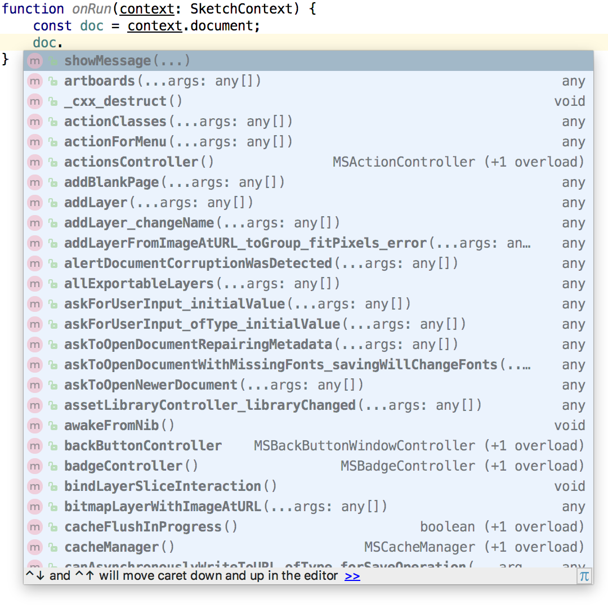

# Sketch.d.ts

TypeScript declaration files for Sketch.

## Known issues
- no types for function arguments (help wanted)

## Usage
Check [sketch.d.ts example plugin](https://github.com/pravdomil/sketch.d.ts-example).

## Autocomplete works

## Thanks to
- [skpm/sketch-headers](https://github.com/skpm/sketch-headers)
- [NativeScript/ios-metadata-generator](https://github.com/NativeScript/ios-metadata-generator)
- [nygard/class-dump](https://github.com/nygard/class-dump)
- [logancollins/Mocha](https://github.com/logancollins/Mocha)

## Donate
[Buy me a beer](https://www.paypal.com/cgi-bin/webscr?cmd=_s-xclick&hosted_button_id=BCL2X3AFQBAP2&item_name=Sketch.d.ts%20Beer)
