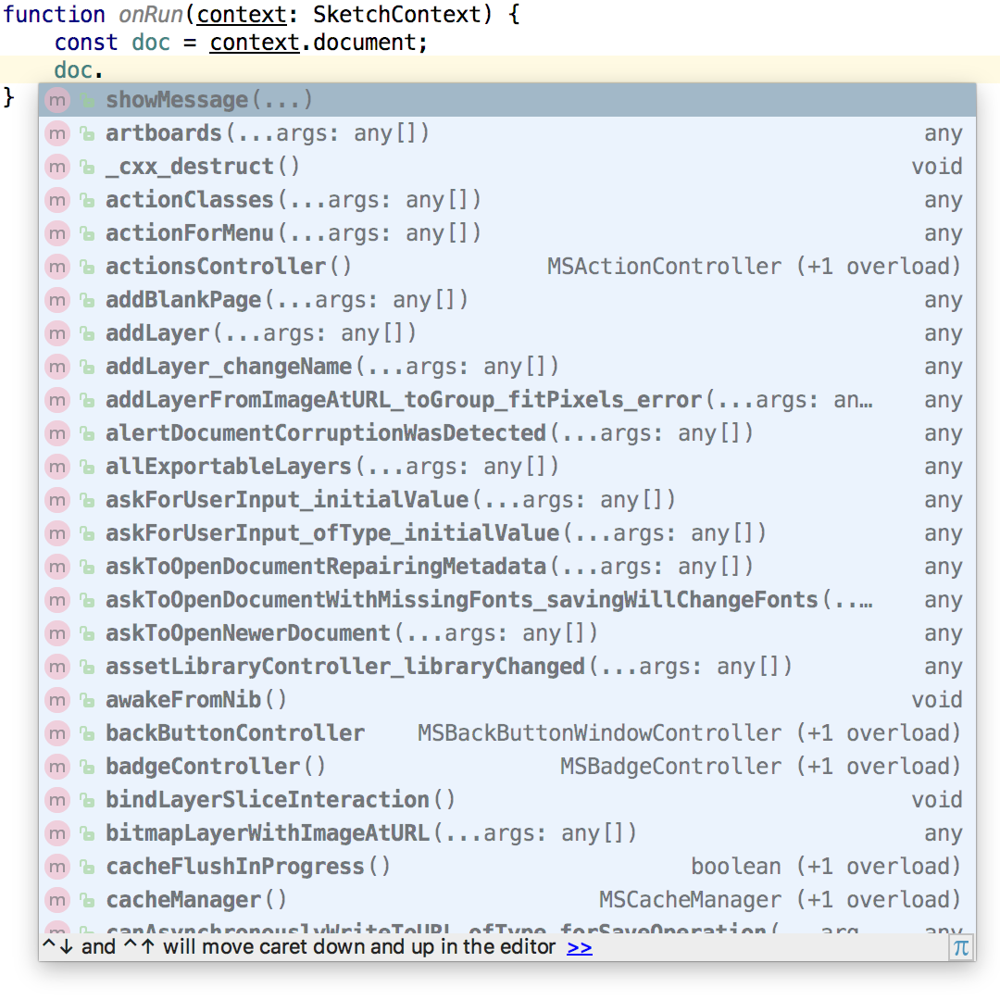

# Sketch.d.ts 47.1

TypeScript declaration files for Sketch.

## Known issues
- no types for function arguments and return types (help wanted)

## Usage
Check [sketch.d.ts example plugin](https://github.com/pravdomil/sketch.d.ts-example).

Or setup install manually:

1. install sketch.d.ts
```
npm i pravdomil/sketch.d.ts
```
2. create tsconfig.json
```json
{
  "compilerOptions": {
    "module": "none",
    "target": "es6",
    "lib": ["es2016"],
    "strict": true
  },
  "exclude": [
    "node_modules"
  ]
}
```
3. create your first ts file
```ts
/// <reference types="sketch.d.ts"/>
```

## Autocomplete works


## Thanks to
- [skpm/sketch-headers](https://github.com/skpm/sketch-headers)
- [abynim/Sketch-Headers](https://github.com/abynim/Sketch-Headers)
- [NativeScript/ios-metadata-generator](https://github.com/NativeScript/ios-metadata-generator)
- [nygard/class-dump](https://github.com/nygard/class-dump)
- [logancollins/Mocha](https://github.com/logancollins/Mocha)

## Donate
[Buy me a beer](https://www.paypal.com/cgi-bin/webscr?cmd=_s-xclick&hosted_button_id=BCL2X3AFQBAP2&item_name=Sketch.d.ts%20Beer)
